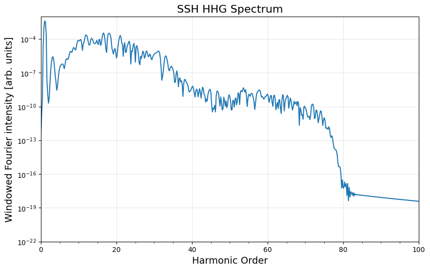

# SSH–HHG

**High-order harmonic generation in one-dimensional dimerized chains**

A Python research toolkit developed to reproduce the SSH-chain studies of Jürß and Bauer [1] and Yu [2]. It connects tight-binding electronic structure, laser-driven dynamics, and coherent bulk–edge contributions to HHG.

## Physical framework

For an open chain of $N$ sites, the SSH Hamiltonian is

$$
H_0 = \sum_{n=1}^{N/2} v\,c^\dagger_{n,A}c_{n,B}
    + \sum_{n=1}^{N/2-1} w\,c^\dagger_{n,B}c_{n+1,A}
    + \mathrm{H.c.}
$$

Here $v$ and $w$ are intracell and intercell hopping amplitudes. With zero on-site potential, $|v|<|w|$ supports topological edge states; in this implementation it corresponds to `delta < 0`. Their presence can strongly modify the subgap harmonic yield [1].

In atomic units, the occupied orbitals evolve in the length gauge:

$$
i\partial_t|\psi_m(t)\rangle = [H_0+E(t)\hat{x}]|\psi_m(t)\rangle,
\qquad E(t)=-\partial_t A(t).
$$

The solver uses midpoint Crank–Nicolson propagation and a sine-squared vector-potential envelope. At half filling, the spectrum follows from the total position expectation and a Hann window $W(t)$:

$$
X(t)=\sum_{m=1}^{N/2}\langle\psi_m(t)|\hat{x}|\psi_m(t)\rangle,
\qquad S(\Omega)\propto\left|\mathcal{F}[W(t)\ddot{X}(t)](\Omega)\right|^2.
$$

## Implementation

- **Models:** finite, open-boundary SSH chains with optional staggered on-site potentials.
- **Dynamics:** sparse Crank–Nicolson evolution of half-filled occupied states.
- **Analysis:** HHG spectra, VB/ES decomposition, static energy/momentum spectral weights, and wavefunctions.

## Quick start

Use Python 3.12 or newer. The local verification baseline is Python 3.13.16.

```bash
git clone https://github.com/timer100/High-Oder-Harmonic-Generation-SSH.git hhg-ssh
cd hhg-ssh
python -m venv .venv
```

Activate `.venv`
```bash
python -m pip install -r requirements.txt
python -m pip install --no-deps -e .
python -m jupyter lab --ip=127.0.0.1
```

`requirements.txt` contains the numerical and notebook dependencies. Install
`requirements-dev.txt` instead for development and notebook validation. 


Explore the simulation and analysis workflows in the tutorial notebooks linked below.



**Tutorials:** [HHG & decomposition](Tutorial_SSH.ipynb) · [Electronic structure](Tutorial_Static_Analysis.ipynb)
**Repository example spectra**: See also the [VB/ES decomposition](Images/HHG_SSH_CD.png).


## References

1. H. Jürß and D. Bauer, “High-harmonic generation in Su-Schrieffer-Heeger chains,” *Physical Review B* **99**, 195428 (2019). [doi:10.1103/PhysRevB.99.195428](https://doi.org/10.1103/PhysRevB.99.195428)
2. C. Yu, “High-order harmonic generation from Su-Schrieffer-Heeger chains with edge states: Three-step processes and their interference,” *Physical Review A* **110**, 033113 (2024). [doi:10.1103/PhysRevA.110.033113](https://doi.org/10.1103/PhysRevA.110.033113)
3. S. B. Rutkevich, “A Formula for Eigenvalues of Jacobi Matrices with a Reflection Symmetry,” *Advances in Mathematical Physics* **2018**, 9784091 (2018). [doi:10.1155/2018/9784091](https://doi.org/10.1155/2018/9784091) · [Full text, Eq. (35)](https://arxiv.org/pdf/1510.01860#page=6)

## Scope and Disclaimer

### Edge-state parity

Nearly degenerate edge states can be mixed by a numerical eigensolver. For the
inversion-symmetric topological chain (`V_A == 0`, `delta < 0`), we explicitly
resolve their odd/even parity and select the occupied edge state using Rutkevich's
eigenvalue-ordering result [3, Eq. (35)]: **odd for `N = 4m`, even for `N = 4m + 2`**.

### Chain-length applicability

The tutorials use `N=100` and `N=800`; these are example sizes, not convergence criteria. Very short chains are outside the intended analysis workflow, and some analysis routines may fail.

### Intended use and liability

This code is intended for academic reference, research, and education and is distributed under the [MIT License](LICENSE), which also permits commercial use subject to its terms. It is provided on an **“AS IS” basis, without warranty of any kind**. Liability is governed by the MIT License. Users are responsible for independently verifying the implementation and physical interpretation before relying on or publishing results. Please cite the relevant original studies when using their methods or findings.

## License

[MIT](LICENSE)
